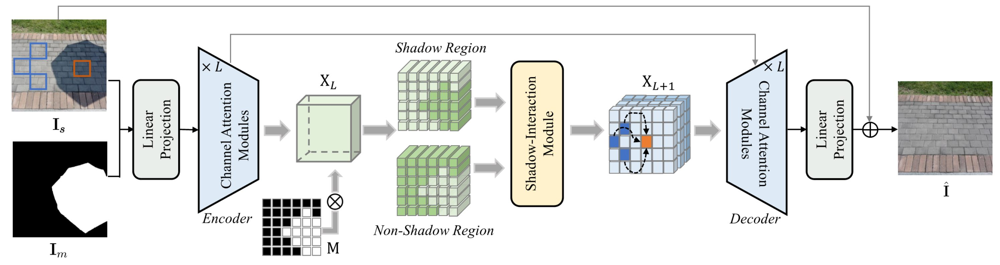
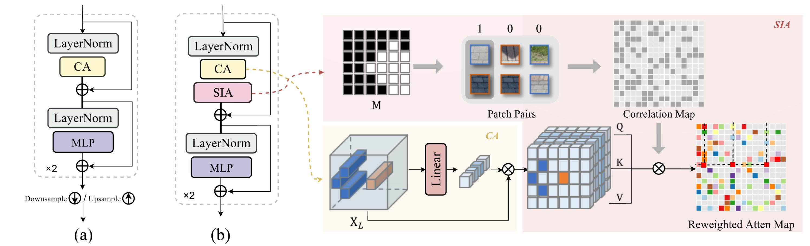
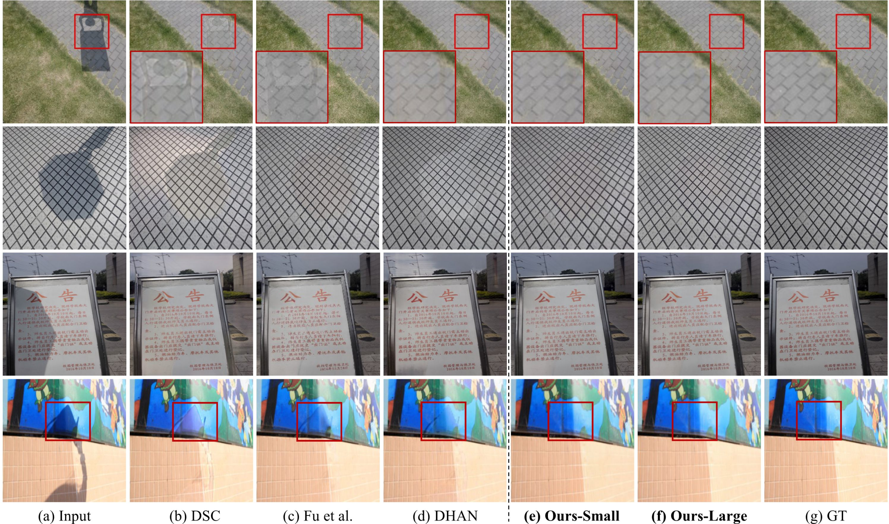

# ShadowFormer (AAAI'23)
This is the official implementation of the AAAI 2023 paper [ShadowFormer: Global Context Helps Image Shadow Removal](https://arxiv.org/pdf/2302.01650.pdf).

[](https://paperswithcode.com/sota/shadow-removal-on-istd?p=shadowformer-global-context-helps-image)
[](https://paperswithcode.com/sota/shadow-removal-on-adjusted-istd?p=shadowformer-global-context-helps-image)
[](https://paperswithcode.com/sota/shadow-removal-on-srd?p=shadowformer-global-context-helps-image)

#### News
* **Feb 24, 2023**: Release the pretrained models for ISTD and ISTD+.
* **Feb 18, 2023**: Release the training and testing codes.
* **Feb 17, 2023**: Add the testing results and the description of our work.

## Introduction
To tackle image shadow removal problem, we propose a novel transformer-based method, dubbed ShadowFormer, for exploiting non-shadow
regions to help shadow region restoration. A multi-scale channel attention framework is employed to hierarchically
capture the global information. Based on that, we propose a Shadow-Interaction Module (SIM) with Shadow-Interaction Attention (SIA) in the bottleneck stage to effectively model the context correlation between shadow and non-shadow regions. 
For more details, please refer to our [original paper](https://arxiv.org/pdf/2302.01650.pdf)

<p align=center></p>

<p align=center></p>

## Requirement
* Python 3.7
* Pytorch 1.7
* CUDA 11.1
```bash
pip install -r requirements.txt
```

## Datasets
* ISTD [[link]](https://github.com/DeepInsight-PCALab/ST-CGAN)  
* ISTD+ [[link]](https://github.com/cvlab-stonybrook/SID)
* SRD [[Training]](https://drive.google.com/file/d/1W8vBRJYDG9imMgr9I2XaA13tlFIEHOjS/view)[[Testing]](https://drive.google.com/file/d/1GTi4BmQ0SJ7diDMmf-b7x2VismmXtfTo/view)

## Pretrained models
[ISTD](https://drive.google.com/file/d/1bHbkHxY5D5905BMw2jzvkzgXsFPKzSq4/view?usp=share_link) | [ISTD+](https://drive.google.com/file/d/10pBsJenoWGriZ9kjWOcE4l4Kzg-F1TFd/view?usp=share_link) | [SRD]()

Please download the corresponding pretrained model and modify the `weights` in `test.py`.

## Test
You can directly test the performance of the pre-trained model as follows
1. Modify the paths to dataset and pre-trained model. You need to modify the following path in the `test.py` 
```python
input_dir # shadow image input path -- Line 27
weights # pretrained model path -- Line 31
```
2. Test the model
```python
python test.py --save_images
```
You can check the output in `./results`.

## Train
1. Download datasets and set the following structure
```
|-- ISTD_Dataset
    |-- train
        |-- train_A # shadow image
        |-- train_B # shadow mask
        |-- train_C # shadow-free GT
    |-- test
        |-- test_A # shadow image
        |-- test_B # shadow mask
        |-- test_C # shadow-free GT
```
2. You need to modify the following terms in `option.py`
```python
train_dir  # training set path
val_dir   # testing set path
gpu: 0 # Our model can be trained using a single RTX A5000 GPU. You can also train the model using multiple GPUs by adding more GPU ids in it.
```
3. Train the network
If you want to train the network on 256X256 images:
```python
python train.py --warmup --win_size 8 --train_ps 256
```
or you want to train on original resolution, e.g., 480X640 for ISTD:
```python
python train.py --warmup --win_size 10 --train_ps 320
```

## Evaluation
The results reported in the paper are calculated by the `matlab` script used in [previous method](https://github.com/zhuyr97/AAAI2022_Unfolding_Network_Shadow_Removal/tree/master/codes). Details refer to `evaluation/measure_shadow.m`.
We also provide the `python` code for calculating the metrics in `test.py`, using `python test.py --cal_metrics` to print.

## Results
#### Evaluation on ISTD
The evaluation results on ISTD are as follows
| Method | PSNR | SSIM | RMSE |
| :-- | :--: | :--: | :--: |
| ST-CGAN | 27.44 | 0.929 | 6.65 |
| DSC | 29.00 | 0.944 | 5.59 |
| DHAN | 29.11 | 0.954 | 5.66 |
| Fu et al. | 27.19 | 0.945 | 5.88 |
| Zhu et al. | 29.85 | 0.960 | 4.27 |
| **ShadowFormer (Ours)** | **32.21** | **0.968** | **4.09** |

#### Visual Results
<p align=center></p>

#### Testing results
The testing results on dataset ISTD, ISTD+, SRD are: [results](https://drive.google.com/file/d/1zcv7KBCIKgk-CGQJCWnM2YAKcSAj8Sc4/view?usp=share_link)

## References
Our implementation is based on [Uformer](https://github.com/ZhendongWang6/Uformer) and [Restormer](https://github.com/swz30/Restormer). We would like to thank them.

Citation
-----
Preprint available [here](https://arxiv.org/pdf/2302.01650.pdf). 

In case of use, please cite our publication:

L. Guo, S. Huang, D. Liu, H. Cheng and B. Wen, "ShadowFormer: Global Context Helps Image Shadow Removal," AAAI 2023.

Bibtex:
```
@article{guo2023shadowformer,
  title={ShadowFormer: Global Context Helps Image Shadow Removal},
  author={Guo, Lanqing and Huang, Siyu and Liu, Ding and Cheng, Hao and Wen, Bihan},
  journal={arXiv preprint arXiv:2302.01650},
  year={2023}
}
```

## Contact
If you have any questions, please contact lanqing001@e.ntu.edu.sg
